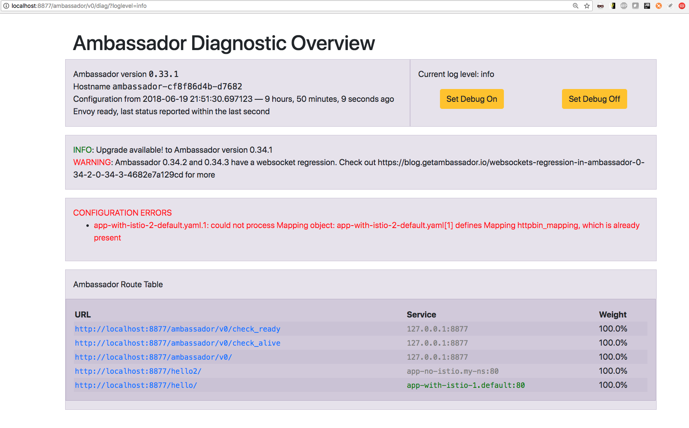

# Deploying ambassador on minikube and hooking it with mTLS enabled istio

### Ambassador diagnostics
kg port-forward ambassador-cf8f86d4b-7l2mg 8877 
[http://localhost:8877/ambassador/v0/diag/?loglevel=info](http://localhost:8877/ambassador/v0/diag/?loglevel=info)

### https://www.getambassador.io/user-guide/with-istio

- Deploying ambassador, rbac roles exception, no access to list configmaps
  https://github.com/datawire/ambassador/issues/437

- better approach would be to create a service account ambassador and grant it roles and responsibilities
  [service account creation process](https://docs.bitnami.com/kubernetes/how-to/configure-rbac-in-your-kubernetes-cluster/)
  [creating a user - certificates](https://kubernetes.io/docs/reference/access-authn-authz/authentication/#users-in-kubernetes)
- default service account settings to make above work:
apiVersion: rbac.authorization.k8s.io/v1
kind: ClusterRoleBinding
metadata:
  name: ambassador-cluster-admin
roleRef:
  apiGroup: rbac.authorization.k8s.io
  kind: ClusterRole
  name: cluster-admin //name of role, making default user admin of namespace api-gateway
subjects:
- kind: ServiceAccount
  name: default  //name of service account or user by default it is default
  namespace: api-gateway
---
apiVersion: rbac.authorization.k8s.io/v1
kind: ClusterRoleBinding
metadata:
  name: ambassador
roleRef:
  apiGroup: rbac.authorization.k8s.io
  kind: ClusterRole
  name: ambassador //name of role, granting default user role ambassador
subjects:
- kind: ServiceAccount
  name: default
  namespace: default
---
apiVersion: rbac.authorization.k8s.io/v1
kind: ClusterRole
metadata:
  name: ambassador
rules:
- apiGroups:
  - ""
  resources:
  - services
  verbs:
  - get
  - list
  - watch
- apiGroups:
  - ""
  resources:
  - configmaps
  verbs:
  - create
  - update
  - patch
  - get
  - list
  - watch
- apiGroups:
  - ""
  resources:
  - secrets
  verbs:
  - get
  - list
  - watch
---
