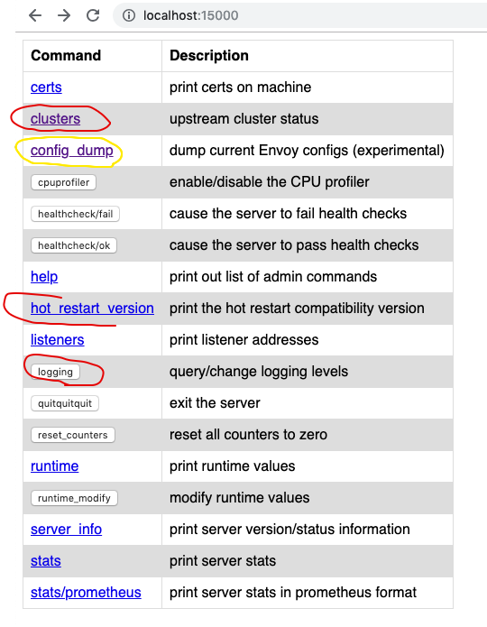

# Envoy concepts
When mtls is enabled, Envoy is a proxy deployed by istio on each mtls enabled pod and istio ingress.  It intercepts and validates each incoming 
and outgoing request to and from a POD resp. 
Similar to NGINx is is also configured using a envoy config. This config can be port is visibale via:

>> `ka port-forward identity-service-7b947747d7-8h2wj 15000:15000`

## Certs: prints certs used and their expiration dates
## clusters: 
it provides quite an important info about each pod envoy is trying to connect to. Envoy uses this info for e.g. for sticky connections to backend pods. 
Envoy is not using k8s services or k8s endpoint resources each time it tries to connect to an underlaying pod, rather it resolves underlaying pods and stores this info in clusters config. 
This config updated by pilot. 

### istio pilot:
Detects changes to k8s services and pods and updates the all envoy configs for all pods.
#### 503 upstream errors: this happens when a pod/istio ingress is trying to connect to an underlaying pod which is deleted. Since pilot takes time to update all configs, this causes 503 upstream erros for some time.
Solution for now: is to setup a default retry strategy in Global destination rule. 

## config dump: 
dumps the whole envoy config & all the services it knows about.

## logging : this can be used to cange envoy logging levels.

